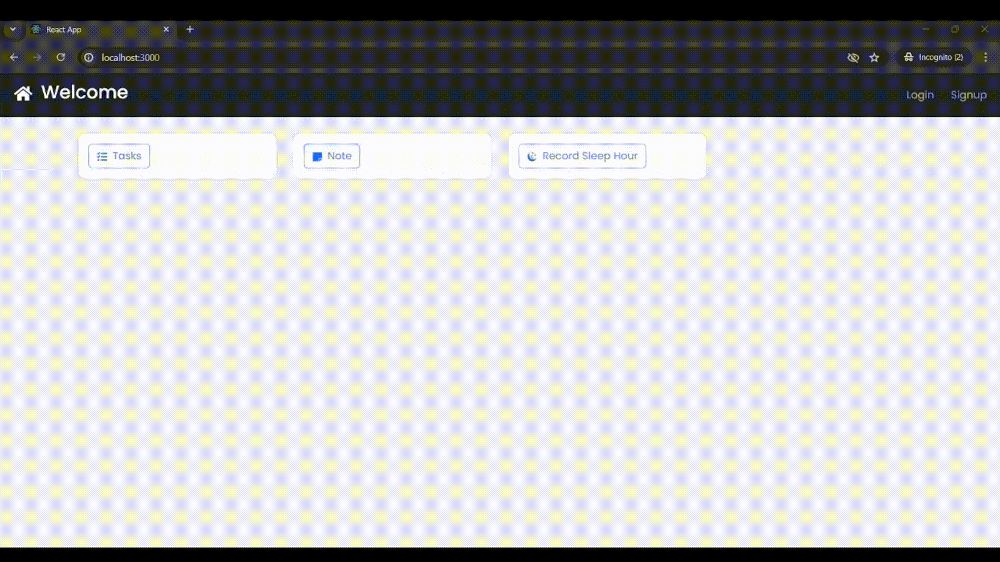
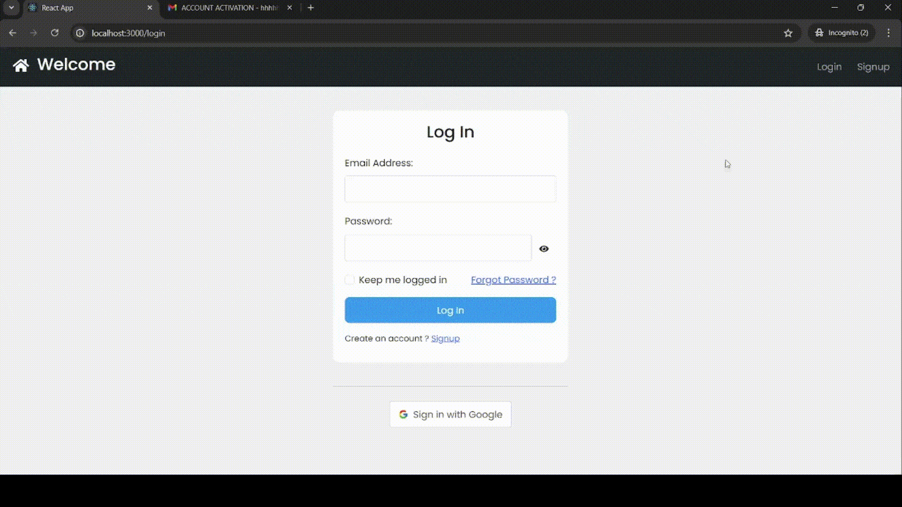
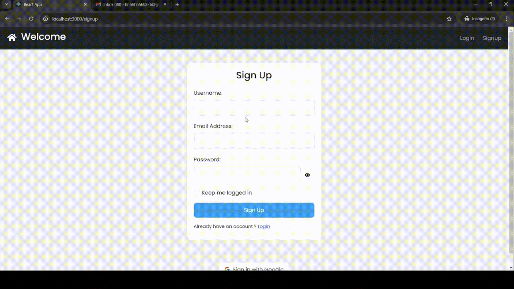

<p align="center">

<h3 align="center">👩🏻‍💻 User Management System 🛡️</h3>
</p>

---

🎉 Welcome to the ultimate **User Management System** designed with security, efficiency, and user experience in mind. This system leverages the **MERN Stack** (MongoDB, Express.js, React.js, Node.js) and utilizes **JSON Web Tokens** (JWT) for secure **Authentication** and **Authorization**. Below is an overview of the key features that make this system a robust and reliable solution for managing user accounts and protecting sensitive data.

---
### 🎈 Key Features

##### 🛡️ Authentication & Authorization 🪪

> - **Signup Option**: Allow new users to create an account easily with a secure signup process.
> - **Login Option**: Enable users to log in to their accounts securely using their credentials.
> - **Logout Option**: Provide a straightforward way for users to log out of their accounts.
> - **Persistent Login**: Offer users the option to stay logged in for 7 days, enhancing convenience while maintaining security.
> - **Weekly Login Requirement**: For added security, users are required to log in at least once a week.
> - **Auto Logout**: Automatically log out users after 15 minutes of inactivity if the persistent login option is not selected.
> - **Abuse Detection**: Utilize reCAPTCHA v3 to detect and prevent abusive traffic or bots.
> - **Email Verification**: Ensure email authenticity with checks for one-time or fake emails, and require email verification for account activation.
> - **Two-Factor Authentication**: Add an extra layer of security with two-factor authentication.

---

##### 🖥️ Login Demo


---

##### 💻 Sign in with Google Demo


---

##### 🖥️ Sign up Demo


---

##### 🛡️ Password and Account Security

> - **Forgot Password Handling**: Users can reset their passwords securely using an OTP (One-Time Password), ensuring both ease of use and security.
> - **Account Protection**: Limit daily OTP requests and login attempts. Immediate account suspension occurs upon detecting suspicious activity to prevent unauthorized access.
> - **Password Encryption**: Use bcrypt to encrypt and safeguard user passwords.
> - **Secure Data Transmission**: Employ JWT to securely transmit information between parties.


##### 🪪 Admin Controls and User Roles 👩🏻‍💻

> - **Immediate User Suspension**: Admins can instantly suspend users to protect company data and system integrity in urgent situations.
> - **Role-Based Authorization**: Assign roles as User or Admin, with appropriate permissions for each.
> - **Status Bar**: Display the current user and their assigned role, providing a clear overview of their status.


---

#### 👩🏻‍💻 User Management ⌨️

> - **Root User Privileges**: The root user has maximum privileges within the system.
> - **User Settings Access**: Only the root user and admins can access user settings.
> - **Admin Privileges**: Admins cannot delete or change each other's profiles.
> - **User Creation**: Root user and admins can create new users.
> - **User Management**: Root user and admins can change a user's name, email, password, and roles.
> - **User Search**: Provides a feature for searching user names to find out user details.
> - **Account Deactivation**: Provide a permission feature that restricts user access as soon as possible if needed.
> - **Account Deletion**: Provide a way to remove user access by deleting accounts.
> - **User Activity Monitoring**: Root and admin users can view if a user is online and the last time they were online in real-time.

---

#### 📝 Task Management 🧾

> - **Task Assignment**: Tasks are assigned to specific users.
> - **Task Viewing**: Users can only view their assigned tasks.
> - **Task Management**: The root user can view, edit, and delete all tasks.
> - **Task Creator Privileges**: Task creators can view, edit, update, and delete tasks they created.
> - **Task Deletion**: Tasks can only be deleted by the admin or root user who created them.
> - **Task Status**: Tasks can have statuses of PENDING, EXPIRED, or COMPLETED.
> - **Task Details**: The status bar shows the task creator, created, and edited date-time details.
> - **Task Assignment Viewing**: Admin and root users can view who has been assigned to a task via the list.


---

#### 📓 Note Management ✏️

> - **Markdown Support**: Users can create, view, edit, and delete their notes with markdown support.
> - **Note Management**: Root user and admins have permission to view, edit, and delete user notes if needed.
> - **Note Search**: Provides search features for titles/tags to view the contents of notes.
> - **Note Tagging**: Tags are provided for tagging notes.

---

### 🪛 Getting Started

The quickest way to get started as shown below:

> Create .env files to manage environment variables for your startup.

##### Server Side

```bash
cd Backend
npm i && npm run dev
```

##### Client Side

```bash
cd Frontend
npm i && npm run start
```

---
